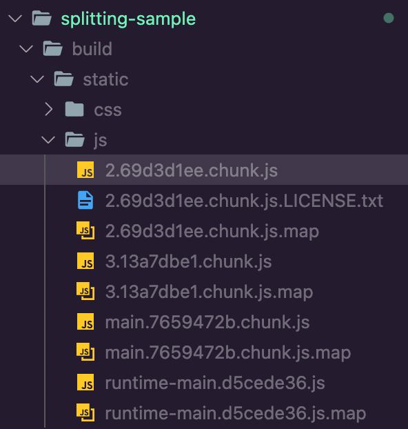

# Code Splitting

스플리팅 ? : 

→ Default 웹팩은 모든 파일들을 하나로 번들링한다.
⇒ 스플리팅을 이용하면 

1. node_modules에서 불러온 파일,
2. 일정 크기 이상의 파일
3. 여러 파일 간에 공유된 파일

을 분리시켜서 캐싱의 효과를 누릴 수 있게 해준다.



`npm run build` 후 번들링 된 결과물.
해시로 되있는 파일은 react, react-dom, node_modules와 관련된 코드 뭉치.
main 으로 되있는 파일은 사용자가 작성한 코드 뭉치.

**⇒ App.js에 코드를 추가하고 build 해보면 해시 뭉치는 바뀌지 않고, main 뭉치만 바뀌는 것을 볼 수 있다.**

이처럼 방대한 양에 대해 캐싱 처리를 해주는 기술이 코드 스플리팅.

# 코드 비동기 로딩

한 파일로 되있다면 매번 오랜 로딩과 방대한 트래픽이 발생.

이를 해결 할 수 있는 것이 코드 비동기 로딩.
→ 필요한 시점에 불러와서 사용하자.

1. JavaScript 함수 비동기 로딩
2. React.lazy와 Suspense를 통한 컴포넌트 비동기 렌더링
3. Loadable Components를 통한 컴포넌트 비동기 렌더링

## JavaScript 함수 비동기 로딩

```jsx
import logo from './logo.svg';
import './App.css';
**import notify from './notify';**

function App() {
  **const onClick = () => {
    notify();
  }**
  return (
    <div className="App">
      <header className="App-header">
        
        **<p onClick={onClick}> Edit <code>src/App.js</code> and save to reload.</p>**
      </header>
    </div>
  );
}

export default App;
```

notify 라는 함수가 main안에 들어가게 됨.

```jsx
import logo from './logo.svg';
import './App.css';

function App() {
  **const onClick = () => {
    import('./notify').then(result => result.default());
  }**
  return (
    <div className="App">
      <header className="App-header">
        
        **<p onClick={onClick}> Edit <code>src/App.js</code> and save to reload.</p>**
      </header>
    </div>
  );
}

export default App;
```

파일을 따로 분리하여 저장했다가, notify가 필요할 때만 import 됨.

## React.lazy와 Suspense

- 리액트 16.6 이전 버전 :

    import함수를 통해 불러온 뒤, 컴포넌트 자체를 state에 넣는 방식 구현.

- React.lazy : 내장된 유틸 함수.
- Suspense : 내장된 컴포넌트.

```jsx
class App extends Component{
  state = {
    SplitMe: null
  };
  handleClick = async() => {
    const loadedModule = await import('./SplitMe');
    this.setState({
      SplitMe: loadedModule.default
    })
  };
  render(){
    const { SplitMe } = this.state;
    return(
      <div className="App">
        <header className="App-header">
          
          <p onClick={this.handleClick}>Hello React!</p>
            {SplitMe && <SplitMe />}
        </header>
      </div>
    );
  }
}
export default App;
```


click 했을 때만 컴포넌트와 함께 스플리팅 된 JS가 로드된다.

Re-Rendering을 위해 매번 state를 바꿔주면서 로드해오는 것 같다.

**즉, state가 계속 필요한데, 이를 개선한 것이 React.lazy & Suspense**

### < React.lazy >

- 렌더링 시점에서 비동기적으로 로딩할 수 있게 도와주는 유틸 함수.

`const SplitMe = React.lazy(() ⇒ import('./SplitMe'));`

### < Suspense >

- fallback을 이용하여 loading 중에 보여줄 JSX를 설정 할 수 있다.

`import React, { Suspense } from 'react';`

`(...)`

`<Suspense fallback={<div>loading...</div>}>`

`<SplitMe />`

`</Suspense>`

## 서버사이드렌더링이 가능한 Loadable Components를 이용한 코드스플리팅.

React.lazy & Suspense 없이 구현이 가능하고, callback함수로 loading을 정의할 수 있음.

preLoad 기능이 가능하다.  mouseover를 했을 때 미리 loading을 한다던지...  너무 좋다

([https://www.smooth-code.com/open-source/loadable-components/docs/delay/](https://www.smooth-code.com/open-source/loadable-components/docs/delay/)).